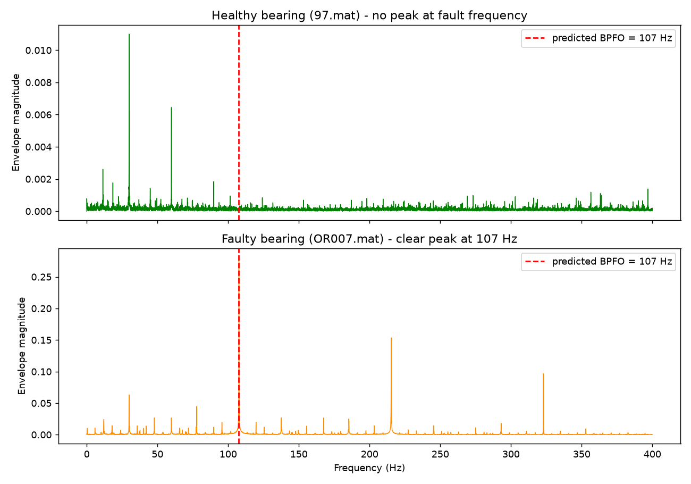

# 🎓 Qasim Bilal — IoT & Embedded Systems Engineer in Progress

### From C/C++ Foundations → ESP32 Firmware → IoT Diagnostics → FFT Signal Analysis → Real Bearing-Fault Data → TinyML Roadmap

> *Building intelligent embedded systems for smart infrastructure, predictive maintenance, and edge AI.*


---

## 👤 About Me

I am a 5th-semester student at **SPbGETU "LETI"**, studying **Infocommunication Technologies and Communication Systems**.

My current technical focus is building a strong foundation in **C/C++ programming, embedded firmware, ESP32-based IoT systems, sensor integration, signal analysis, and TinyML-oriented predictive maintenance**.

This repository documents my step-by-step engineering journey: from basic programming fundamentals to a working embedded IoT motor fault-diagnosis prototype, and on to **frequency-domain analysis of real recorded bearing-fault data**.

---

## 🧭 Learning Roadmap

| Phase | Focus Area | Status |
|------:|------------|:------:|
| ✅ Phase 1 | C programming foundations | Completed |
| ✅ Phase 2 | C++ OOP and sensor-fusion logic | Completed |
| ✅ Phase 3 | ESP32 embedded firmware simulation | Completed |
| ✅ Phase 4 | IoT node with OLED + Wi-Fi transmission | Completed |
| ✅ Phase 5A | FFT vibration analyzer (pipeline) | Completed |
| ✅ Phase 5B | FFT merged with DiagnosticEngine + IoT system | Completed |
| ✅ Phase 5C | FFT validated on **real CWRU bearing data** | Completed |
| ⏳ Phase 6 | TinyML motor fault classification | Planned |

---

## 📚 Phase 1 — C Foundations

| Day | File | Topic |
|----:|------|-------|
| 1 | `hello.c` | Hello World, `printf()` |
| 2 | `day2_input.c` | Variables, input, `scanf()` |
| 3 | `day3_decisions.c` | `if/else`, `switch` |
| 4 | `day4_loops.c` | `for` loops |
| 5 | `day5_while.c` | `while` loops, grade calculator |
| 6 | `day6_functions.c` | Functions and scope |
| 7 | `day7_arrays.c` | Arrays and sorting |
| 8 | `day8_student_db.c` | Structs, pointers, file I/O |

---

## 🧱 Phase 2 — C++ and OOP

| Day | File | Concept |
|----:|------|---------|
| 9 | `day9_classes.cpp` | Classes and encapsulation |
| 10 | `day10_fault_detector.cpp` | Constructors and fault logic |
| 11 | `motorguard.cpp` | Inheritance and polymorphism |
| 12 | `motorguard_v2.cpp` | Sensor fusion and DiagnosticEngine |

---

# ⭐ Flagship Project — MotorGuard

**MotorGuard** is a progressive embedded systems project for **motor health monitoring and predictive maintenance**.

It began as a C++ simulation and evolved into a full ESP32-based IoT diagnostic node, then into **frequency-domain analysis validated against real recorded vibration data**:

- 🌡️ Temperature monitoring
- 📳 Vibration monitoring
- ⚡ Current monitoring
- 🔊 Acoustic monitoring
- 🧠 Rule-based DiagnosticEngine
- 🖥️ OLED display output
- 📡 Wi-Fi / HTTP IoT transmission
- 🔬 FFT-based vibration analysis (simulation **and** real data)
- 📊 Health score calculation
- 🚨 Multi-fault detection

🔗 **Live Wokwi Simulation:** [Run MotorGuard ESP32 Sensor Node](https://wokwi.com/projects/467254523497153537)

## 📁 Project Files

The ESP32 firmware is organized inside the `firmware/` folder; the Python real-data analysis lives in `analysis/`.

| File | Purpose |
|------|---------|
| `firmware/motorguard_fft_analyzer_stage5a.ino` | Standalone FFT vibration analyzer that classifies normal running, rotor imbalance, and bearing defect by dominant-frequency detection. |
| `firmware/motorguard_stage5b_integrated.ino` | Full integrated MotorGuard firmware: sensors, DiagnosticEngine, FFT, OLED, Wi-Fi, HTTP IoT, health score, multi-fault diagnosis. |
| `analyze_bearing.py` | Loads a real CWRU `.mat` recording, runs envelope-FFT analysis, and compares the detected fault frequency against the physics-predicted value. |
| `plot_bearing.py` | Plots the envelope spectra of a healthy vs faulty bearing side by side. |

---

## 🧠 MotorGuard v1 — C++ Sensor Model

`motorguard.cpp` introduces the first object-oriented structure of the project.

### Key features

- Sensor classes for temperature, vibration, current, and acoustic channels
- Inheritance and polymorphism
- Clean OOP architecture for sensor-based systems
- Early fault-status output logic

---

## 🧠 MotorGuard v2 — DiagnosticEngine

`motorguard_v2.cpp` adds sensor-fusion logic through a dedicated **DiagnosticEngine**.

| Fault Type | Detection Rule |
|-----------|----------------|
| 🔩 Bearing defect | High vibration + abnormal acoustic signal |
| 🌀 Rotor imbalance | High vibration condition |
| ⚡ Electrical overload | High current and/or high temperature |
| 🌡️ Overheating | High temperature condition |
| 🚨 Abnormal current draw | Critical current level |

### Diagnostic output

- Specific fault name
- Health score from **0–100%**
- Maintenance recommendation
- Support for simultaneous faults

---

# 🔌 ESP32 MotorGuard IoT Node

A complete embedded IoT prototype built and tested in **Wokwi** using an **ESP32 DevKit**.

## Hardware / Simulation Components

| Component | Purpose | Pin / Interface |
|----------|---------|-----------------|
| ESP32 DevKit | Main microcontroller | — |
| DHT22 | Temperature sensor | GPIO 15 |
| Potentiometer | Vibration channel | GPIO 34 |
| Potentiometer | Current channel | GPIO 35 |
| Potentiometer | Acoustic channel | GPIO 32 |
| SSD1306 OLED | Live display | I2C: SDA 21, SCL 22 |
| Wi-Fi | IoT data transmission | `Wokwi-GUEST` |

> **Note on the simulation:** vibration, current, and acoustic channels are driven by potentiometers acting as adjustable analog inputs. This validates the firmware, display, networking, and diagnostic logic end to end. The potentiometers stand in for real transducers, which is the natural next step on physical hardware.

---

## ⚙️ Embedded System Architecture

```text
Sensor Layer
   │
   ├── DHT22 temperature
   ├── Vibration channel
   ├── Current channel
   └── Acoustic channel

Processing Layer
   │
   ├── ESP32 firmware
   ├── DiagnosticEngine
   ├── FFT vibration analyzer
   └── Health score calculation

Output Layer
   │
   ├── OLED display
   ├── Serial Monitor
   └── HTTP IoT transmission
```

---

# ✅ Development Stages

## ✅ Stage 1 — Multi-Sensor Layer

The ESP32 reads all sensor channels in real time:

- 🌡️ Temperature from DHT22
- 📳 Vibration from analog input
- ⚡ Current from analog input
- 🔊 Acoustic level from analog input

**Result:** All four channels successfully produced live values in the Serial Monitor.

---

## ✅ Stage 2 — DiagnosticEngine on ESP32

The C++ DiagnosticEngine logic was transferred from desktop simulation to embedded firmware.

### Implemented diagnostic rules

| Condition | Diagnosis |
|----------|-----------|
| High vibration + acoustic signal | Bearing defect |
| High vibration only | Rotor imbalance |
| High temperature + high current | Electrical overload / winding stress |
| High temperature only | Overheating |
| High current only | Abnormal current draw |

**Result:** Multiple simultaneous faults were reported correctly from combined sensor inputs.

Example output:

```text
[FAULT] Bearing defect
[FAULT] Electrical overload
Health: 20%
```

---

## ✅ Stage 3 — OLED Display Integration

An **SSD1306 128×64 OLED display** was added through I2C.

The display shows live sensor values, fault status, diagnostic result, and health score.

Example OLED output:

```text
MotorGuard v2
T:24C V:8.6
C:15.0A A:94
[FAULT] Bearing
Health: 20%
```

---

## ✅ Stage 4 — Wi-Fi / IoT Transmission

The ESP32 was connected to Wi-Fi using the Wokwi simulated network.

### Implemented features

- Wi-Fi connection through `Wokwi-GUEST`
- HTTP request generation
- Sensor, fault-status, and health-score transmission

**Result:**

```text
WiFi: CONNECTED
IoT data sent. HTTP code: 200
```

---

# 🔬 Stage 5A — FFT Vibration Analyzer (Pipeline Validation)

Stage 5A introduced **frequency-domain vibration analysis** using FFT, so the system can identify vibration faults by their dominant frequency rather than by amplitude thresholds alone.

### FFT concept

```text
Time-domain vibration signal → FFT → Dominant frequency → Fault classification
```

### Pipeline test (synthetic signals)

To validate that the FFT pipeline reads frequencies correctly, known **synthetic test signals** were generated on-device and passed through the FFT. The detected frequency was compared against the injected one:

| Mode | Injected (synthetic) | FFT Detected | Pipeline check |
|------|---------------------:|-------------:|:--------------:|
| Normal running | 50.0 Hz | 49.9 Hz | ✅ pass |
| Rotor imbalance | 25.0 Hz | 24.8 Hz | ✅ pass |
| Bearing defect | 120.0 Hz | 120.4 Hz | ✅ pass |

> **Honest scope:** these tests confirm the FFT pipeline reads back the frequency it was given — i.e. the signal-processing chain works end to end. They are **not** detection of a real mechanical fault; the input was a synthetic tone. Real-fault validation is done in **Stage 5C** below, on recorded data.

---

# 🚀 Stage 5B — Full Integration

Stage 5B merged the FFT analyzer with the complete MotorGuard IoT system.

## Integrated system includes

- 🌡️ DHT22 temperature sensing
- 📳 Vibration monitoring
- ⚡ Current monitoring
- 🔊 Acoustic monitoring
- 🧠 DiagnosticEngine
- 🔬 FFT vibration analysis
- 🖥️ OLED display
- 📡 Wi-Fi connection
- 🌐 HTTP IoT transmission
- 📊 Health score calculation
- 🚨 Multi-fault diagnosis

### Example integrated output (synthetic vibration input)

```text
FFT mode: BEARING
Injected FFT frequency: 120.0 Hz
FFT dominant frequency: 120.4 Hz
FFT diagnosis: Bearing defect
Final diagnosis: Bearing
Health: 45%
WiFi: CONNECTED
IoT data sent. HTTP code: 200
```

**Result:** Stage 5B demonstrated a complete IoT predictive-maintenance node combining FFT-based vibration analysis with multi-fault reporting, using synthetic vibration input on the microcontroller.

---

# 🧪 Stage 5C — Real Bearing-Fault Analysis (CWRU Dataset)

After validating the FFT pipeline in simulation, I moved to **real recorded vibration data** to test the method against ground truth. This stage runs in **Python on a workstation**, because the recordings are far larger than a microcontroller can process.

**Data source:** [Case Western Reserve University (CWRU) Bearing Data Center](https://engineering.case.edu/bearingdatacenter) — drive-end accelerometer recordings of a 2 HP motor with an **SKF 6205** deep-groove bearing, sampled at **12 kHz**.

### Method

1. **Predict the fault frequency from physics.** Using the bearing geometry (9 balls, ball diameter 0.3126 in, pitch diameter 1.537 in) and shaft speed (1797 RPM), the outer-race defect frequency (**BPFO**) is calculated:

   ```text
   BPFO = (n/2) · fr · (1 − d/D · cos θ) = 107.4 Hz
   ```

2. **Envelope analysis + FFT.** A bearing defect's frequency is weak directly but modulates the high-frequency housing resonance. Applying the Hilbert-transform envelope before the FFT demodulates it — the standard technique in bearing diagnostics.

3. **Compare detected peak vs prediction**, on both a faulty and a healthy recording.

### Results (real data)

| File | Bearing state | Detected peak | Predicted BPFO | Outcome |
|------|---------------|--------------:|---------------:|---------|
| `OR007.mat` | Outer-race fault | **107.6 Hz** | 107.4 Hz | Match (0.2% error) |
| `97.mat` | Healthy | 29.9 Hz (shaft only) | 107.4 Hz | No fault — correct |

The faulty bearing shows a clear peak at the predicted fault frequency, with harmonics at ~214 Hz and ~321 Hz (the classic outer-race "comb"). The healthy bearing shows only shaft rotation (~30 Hz) and no peak at 107 Hz.

```text
==================================================
  Analysing: OR007.mat
==================================================
Samples loaded: 121991
Duration: 10.17 seconds

Physics prediction (BPFO): 107.4 Hz
FFT detected peak:         107.6 Hz
Difference:                0.2 %
--------------------------------------------------
RESULT: MATCH - outer-race fault confirmed.
--------------------------------------------------
```



*Envelope FFT of both bearings. The healthy bearing (top) shows only shaft rotation; the faulty bearing (bottom) shows a clear peak at the predicted outer-race fault frequency plus harmonics.*

**Why this stage matters:** unlike the synthetic pipeline tests, here the fault frequency was **predicted from first principles** and then **confirmed in independent real recordings** — and the method correctly separates a faulty bearing from a healthy one. This is genuine bearing-fault detection, not a self-referential test.

**Tools:** Python, NumPy, SciPy (`signal`, `fft`), Matplotlib.

---

# 🛠️ Skills Developed

| Area | Skills Practiced |
|------|------------------|
| C programming | Variables, loops, functions, arrays, structs, pointers, file I/O |
| C++ programming | Classes, constructors, inheritance, polymorphism, object-oriented design |
| Embedded firmware | ESP32, Arduino-style firmware, `setup()`, `loop()`, GPIO, ADC |
| Sensor systems | DHT22, analog channels, simulated vibration/current/acoustic signals |
| Display systems | SSD1306 OLED, I2C communication, embedded UI output |
| IoT communication | Wi-Fi connection, HTTP GET requests, sensor data transmission |
| Signal processing | FFT, **envelope analysis (Hilbert transform)**, dominant-frequency detection |
| Bearing diagnostics | **Characteristic defect frequencies (BPFO/BPFI/BSF)**, physics-based fault prediction |
| Real-data analysis | **CWRU dataset**, `.mat` loading, healthy-vs-fault comparison |
| Fault diagnosis | Threshold logic, sensor fusion, multi-fault classification |
| Tools | VS Code, g++, Git, GitHub, Wokwi, Serial Monitor, **Python / NumPy / SciPy / Matplotlib** |

---

# 🧪 Technical Highlights

- Built a complete ESP32 predictive-maintenance prototype in simulation
- Developed progressive C/C++ code from basics to embedded diagnostics
- Implemented multi-sensor fault-detection logic with sensor fusion
- Added live OLED monitoring and Wi-Fi-based IoT transmission
- Validated an FFT signal-processing pipeline with synthetic test signals
- **Predicted bearing fault frequencies from physical geometry and confirmed them in real CWRU recordings via envelope-FFT analysis (0.2% error)**
- **Demonstrated correct separation of a faulty bearing from a healthy one on real data**
- Prepared the foundation for future TinyML classification

---

# 🧭 Research Roadmap

## ✅ Current Focus — Embedded IoT Fault Diagnosis + Real-Data Validation

```text
Sensors → ESP32 → DiagnosticEngine → FFT → OLED → Wi-Fi → IoT reporting
Real CWRU data → Envelope FFT → Physics-predicted fault frequency → Confirmed
```

## ⏳ Next Step — TinyML Edge Fault Classification

The next technical direction is to move from rule-based and frequency-threshold diagnosis toward machine-learning-based classification.

### Planned direction

- Collect / use labelled vibration-fault data (CWRU and others)
- Extract FFT / envelope features
- Train a small ML model
- Convert to TensorFlow Lite Micro
- Deploy inference on ESP32 or STM32
- Compare rule-based vs TinyML diagnosis

---

# 📊 Progress Tracker

| Semester | Focus | Status |
|---------:|-------|:------:|
| 5th semester | C/C++, ESP32 firmware, IoT, FFT analysis, real-data validation | ✅ Active / Completed milestones |
| 6th semester | Real ESP32 hardware, MQTT, cloud dashboard, STM32 basics | ⏳ Planned |
| 7th semester | TinyML fault classification and research paper preparation | ⏳ Planned |
| 8th semester | Final-year embedded AI / smart infrastructure project | ⏳ Planned |

---

# 🎯 Vision

My long-term goal is to contribute to **intelligent embedded systems for smart energy infrastructure and predictive maintenance**, where sensors, real-time diagnostics, signal processing, and edge AI make industrial systems safer, smarter, and more reliable.

> *MotorGuard is my foundation project toward embedded AI, smart infrastructure, and industrial predictive maintenance.*

— **Qasim Bilal**
ETU "LETI" | Infocommunication Technologies and Communication Systems | 2026
